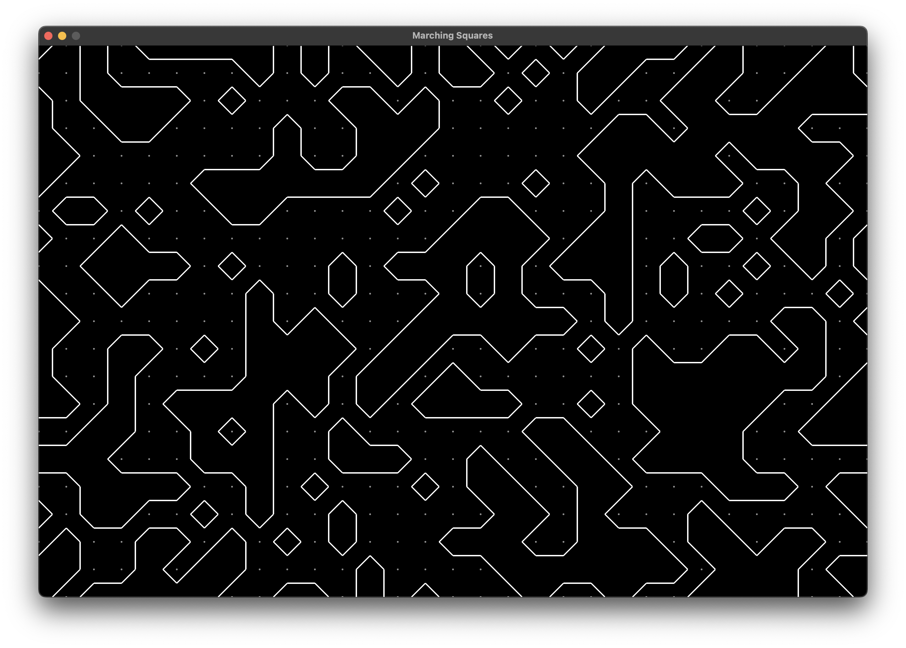

# MarchingSquares
This is a simple implementation of the marching squares algorithm in C# using Raylib-cs for graphics.

Example:

First, a 2D grid of Points is created and filled. Each Point is given a random value of either 0 or 1. When the algorithm is run on the 2D grid, we get the "state" of each cell in the grid by checking the value of the neighboring points. Using those binary values, we get the base 10 state, which we use in a switch statement to draw the appropraite line from all of the possible cases.

For this example, all of the points and values are integers. This could be expanded further using floating point values and using linear interpolation to place the points of each line in between actual points on the grid.

Reference: https://en.wikipedia.org/wiki/Marching_squares